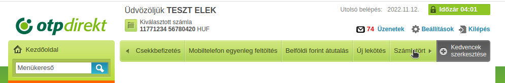
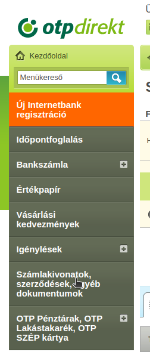
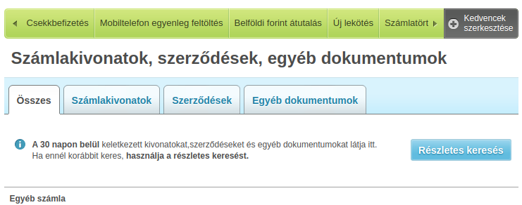

# otp-statement-extractor
Tool for extracting account records from PDF statement files of OTP Bank

Segédprogram adatok kinyerésére az OTP Bank által generált számlatörténetekből

A program kimenete CSV formátum.

## Futtatás

A program futtatásához jelenleg Python 3 telepítésére van szükség.

Python telepítése után elsőként telepíteni kell a használt modulokat:

```
pip install -r requirements.txt
```

Ezt követően a következő paranccsal futtatható:

```
python3 otp_extractor.py
```

A program egy pdf file nevét, vagy pdf-eket tartalmazó könyvtárat vár paraméterül

## PDFek letöltése az OTP felületéről

### Régi netbankon (OTPdirekt)

URL: https://www.otpbank.hu/portal/hu/OTPdirekt/Belepes

a Számlatörténet > Számlakivonatok > Részletes keresés alatt lehetséges.

Az exportált intervalum maximum 1 év lehet.

A felületen 2010től lehet exportálni adatot.

Avagy:








### Új netbankon

URL: https://internetbank.otpbank.hu/fooldal

A felhasználói menüben a Dokumentumaim elemre kattintva.

A bal oldali szűrés oszlopban kiválasztható a dátum (Az intervalum maximum 1 év lehet).

Majd az összes elem kijelölése után azok letölthetőek.

A felületen az utolsó 10 évből lehet exportálni adatot.


## Limitációk

- Nem olvas 2010jan1-2011feb28 között generált fileokat
- Betétek adatait nem extraktálja
